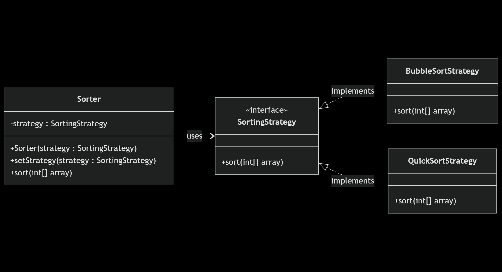

# Act_1_Design_Patterns

## Getting Started

### Install Dependencies
```console
mvn clean install
```

## Design Patterns

### Strategy Pattern
   
This pattern is used when we have multiple algorithms for a specific task, and the client decides the actual implementation be used at runtime. A strategy pattern is also known as a policy pattern. We define multiple algorithms and let client applications pass the algorithm to be used as a parameter.

#### Class Diagram

```
---
title: Strategy DP example
---
classDiagram
    direction LR

    class SortingStrategy {
        <<interface>>
        +sort(int[] array)
    }

    class BubbleSortStrategy {
        +sort(int[] array)
    }

    class QuickSortStrategy {
        +sort(int[] array)
    }

    class Sorter {
        -strategy : SortingStrategy
        +Sorter(strategy : SortingStrategy)
        +setStrategy(strategy : SortingStrategy)
        +sort(int[] array)
    }

    Sorter --> SortingStrategy : uses
    SortingStrategy <|.. BubbleSortStrategy : implements
    SortingStrategy <|.. QuickSortStrategy : implements
```



### Bibliographic References

Kumar, P. (2022, agosto 3). _Most Common Design Patterns in Java (With Examples)_. Digitalocean.com. https://www.digitalocean.com/community/tutorials/java-design-patterns-example-tutorial