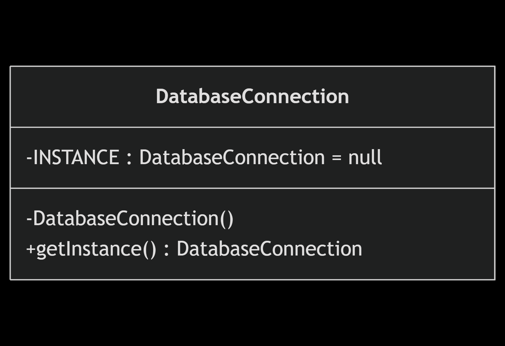

# Act_1_Design_Patterns

## Getting Started

### Install Dependencies
```console
mvn clean install
```

# Design Patterns

## Strategy Pattern
   
This pattern is used when we have multiple algorithms for a specific task, and the client decides the actual implementation be used at runtime. A strategy pattern is also known as a _policy_ pattern. We define multiple algorithms and let client applications pass the algorithm to be used as a parameter.

### Workflow

#### Class Diagram

```
---
title: Strategy DP example
---
classDiagram
    direction LR

    class SortingStrategy {
        <<interface>>
        +sort(int[] array)
    }

    class BubbleSortStrategy {
        +sort(int[] array)
    }

    class QuickSortStrategy {
        +sort(int[] array)
    }

    class Sorter {
        -strategy : SortingStrategy
        +Sorter(strategy : SortingStrategy)
        +setStrategy(strategy : SortingStrategy)
        +sort(int[] array)
    }

    Sorter --> SortingStrategy : uses
    SortingStrategy <|.. BubbleSortStrategy : implements
    SortingStrategy <|.. QuickSortStrategy : implements
```


### Singleton Pattern

The singleton pattern restricts the instantiation of a class and ensures that only one instance of the class exists in the Java Virtual Machine. The implementation of the singleton pattern has always been a controversial topic among developers.

```java
public class Singleton {
    private static Singleton INSTANCE = new Singleton();

    private Singleton() { }

    public static Singleton getInstance() {
        return INSTANCE;
    }

}
```

However, there are some optimizations that we can apply on it. Instead of initializing the instance directly, which happens when the application starts, we can improve that by moving the initialization step to the getInstance() method so that we can create the instance only when we need it, and not all the time when the class is loaded. This is call _lazy initialization_.

```java
public final class Singleton {
    private static Singleton INSTANCE = null;

    private Singleton() { }

    public static Singleton getInstance() {
        if (INSTANCE == null) {
            INSTANCE = new Singleton();
        }

        return INSTANCE;
    }

}
```

### Workflow

#### Class Diagram

```
---
title: Singleton DP example
---
classDiagram
    direction LR

    class DatabaseConnection {
        -INSTANCE : DatabaseConnection = null
        -DatabaseConnection()
        +getInstance() DatabaseConnection
    }
```



### Bibliographic References

Kumar, P. (2022, August 3rd). _Most Common Design Patterns in Java (With Examples)_. Digitalocean.com. https://www.digitalocean.com/community/tutorials/java-design-patterns-example-tutorial

Coding Shuttle. (2024, December 12th). _10 Essential Java Design Patterns Every Developer Should Master (With Code Examples)_. Codingshuttle.com. https://www.codingshuttle.com/blogs/top-8-design-patterns-in-java/

Visual Computer Science. (S/f). _Top 3 Creational Design Patterns You Should Know!_. Youtube.com. Retrieved on el 4 September 2025 from https://www.youtube.com/watch?v=G4TjjzQT8gw&t=304s