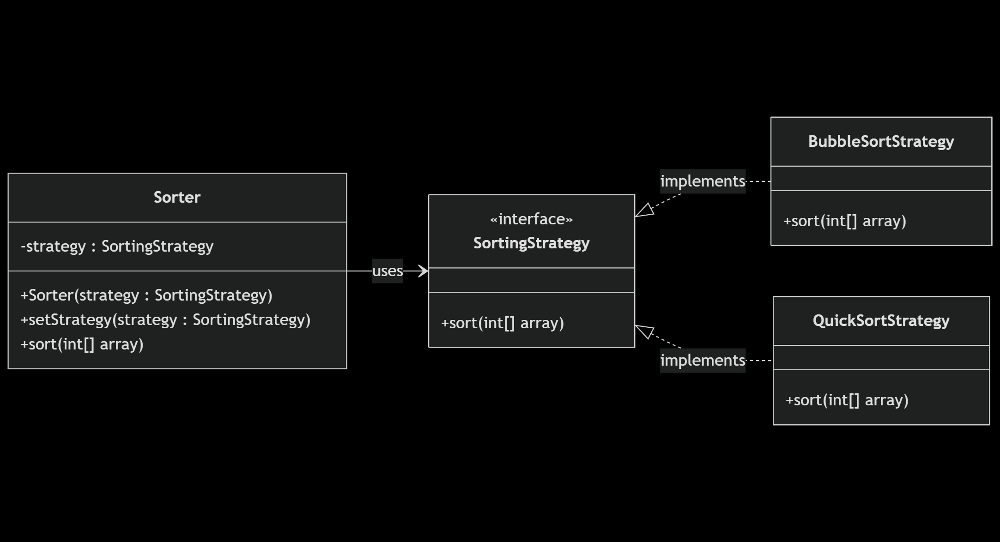
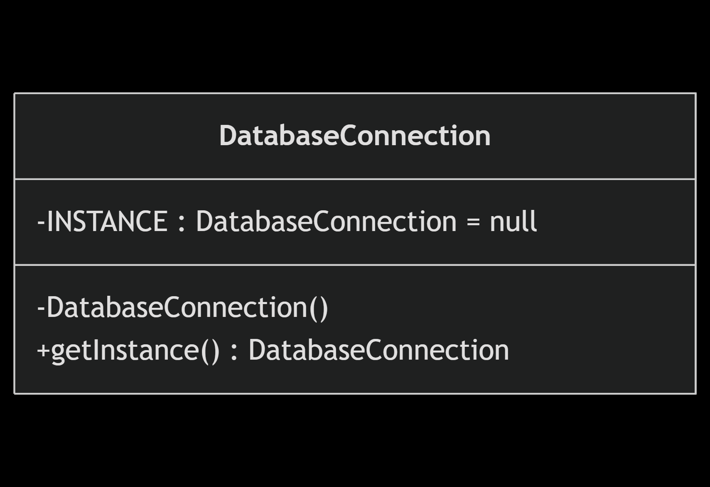
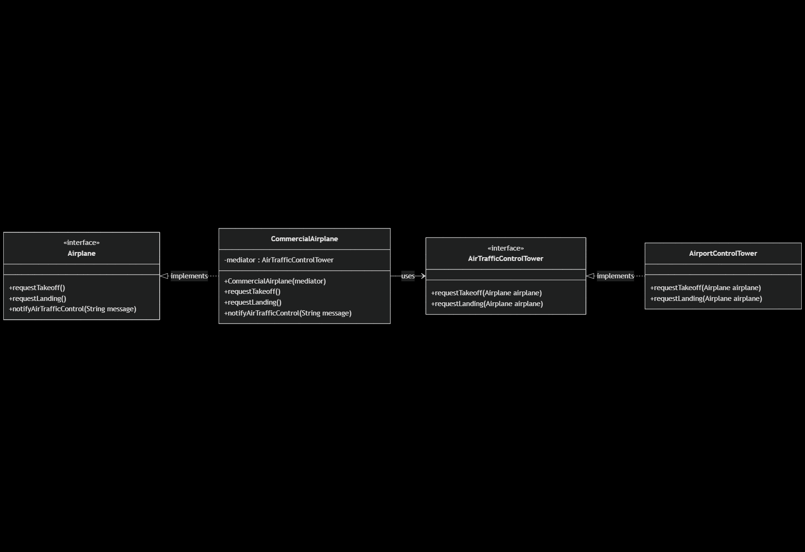
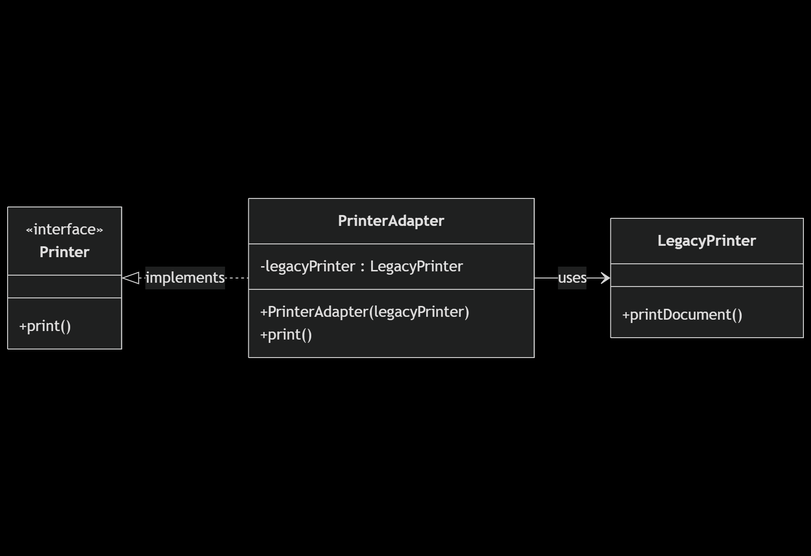
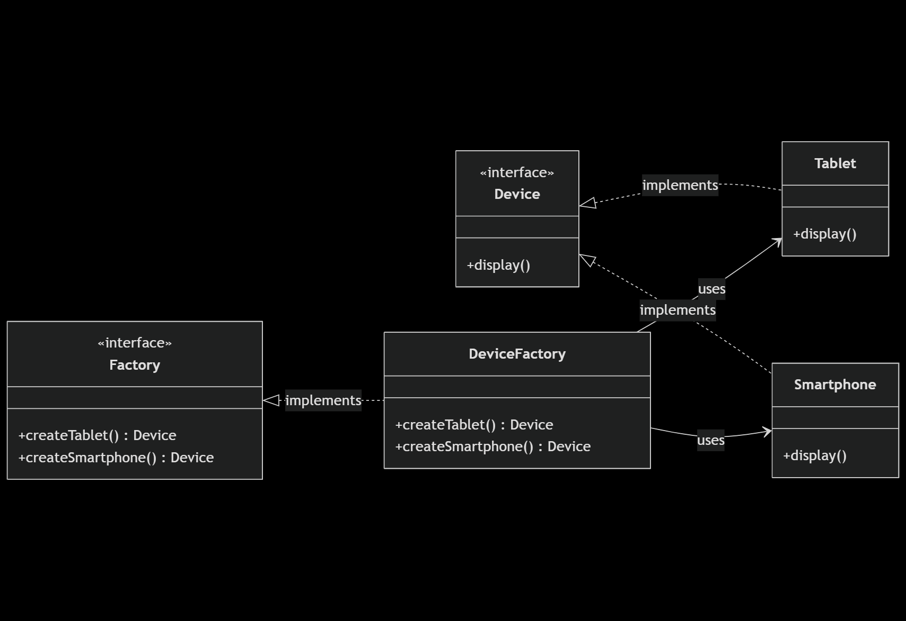

# Act_1_Design_Patterns

## Getting Started

### Install Dependencies
```console
mvn clean install
```

# Design Patterns

## Strategy
   
This pattern is used when we have multiple algorithms for a specific task, and the client decides the actual implementation be used at runtime. A strategy pattern is also known as a _policy_ pattern. We define multiple algorithms and let client applications pass the algorithm to be used as a parameter.

### Workflow

#### Class Diagram

```
---
title: Strategy DP example
---
classDiagram
    direction LR

    class SortingStrategy {
        <<interface>>
        +sort(int[] array)
    }

    class BubbleSortStrategy {
        +sort(int[] array)
    }

    class QuickSortStrategy {
        +sort(int[] array)
    }

    class Sorter {
        -strategy : SortingStrategy
        +Sorter(strategy : SortingStrategy)
        +setStrategy(strategy : SortingStrategy)
        +sort(int[] array)
    }

    Sorter --> SortingStrategy : uses
    SortingStrategy <|.. BubbleSortStrategy : implements
    SortingStrategy <|.. QuickSortStrategy : implements
```



### Singleton

The singleton pattern restricts the instantiation of a class and ensures that only one instance of the class exists in the Java Virtual Machine. The implementation of the singleton pattern has always been a controversial topic among developers.

```java
public class Singleton {
    private static Singleton INSTANCE = new Singleton();

    private Singleton() { }

    public static Singleton getInstance() {
        return INSTANCE;
    }

}
```

However, there are some optimizations that we can apply on it. Instead of initializing the instance directly, which happens when the application starts, we can improve that by moving the initialization step to the getInstance() method so that we can create the instance only when we need it, and not all the time when the class is loaded. This is call _lazy initialization_.

```java
public final class Singleton {
    private static Singleton INSTANCE = null;

    private Singleton() { }

    public static Singleton getInstance() {
        if (INSTANCE == null) {
            INSTANCE = new Singleton();
        }

        return INSTANCE;
    }

}
```

### Workflow

#### Class Diagram

```
---
title: Singleton DP example
---
classDiagram
    direction LR

    class DatabaseConnection {
        -INSTANCE : DatabaseConnection = null
        -DatabaseConnection()
        +getInstance() DatabaseConnection
    }
```



### Mediator

The mediator design pattern is used to provide a centralized communication medium between different objects in a system. If the objects interact with each other directly, the system components are tightly-coupled with each other which makes maintainability cost higher and not flexible to extend easily. The mediator pattern focuses on providing a mediator between objects for communication and implementing loose-coupling between objects. The mediator works as a router between objects, and it can have its own logic to provide a way of communication.

### Workflow

#### Class Diagram

```
---
title: Mediator DP example
---
classDiagram
  direction LR

  class AirTrafficControlTower {
    <<interface>>
    +requestTakeoff(Airplane airplane)
    +requestLanding(Airplane airplane)
  }

  class AirportControlTower {
    +requestTakeoff(Airplane airplane)
    +requestLanding(Airplane airplane)
  }
  
  class Airplane {
    <<interface>>
    +requestTakeoff()
    +requestLanding()
    +notifyAirTrafficControl(String message)
  }

  class CommercialAirplane {
    -mediator : AirTrafficControlTower
    +CommercialAirplane(mediator)
    +requestTakeoff()
    +requestLanding()
    +notifyAirTrafficControl(String message)
  }

  AirTrafficControlTower <|.. AirportControlTower : implements
  Airplane <|.. CommercialAirplane : implements
  CommercialAirplane --> AirTrafficControlTower : uses
```



### Adapter

The adapter design pattern is one of the structural design patterns and is used so that two unrelated interfaces can work together. The object that joins these unrelated interfaces is called an adapter.

### Workflow

#### Class Diagram

```
---
title: Adapter DP example
---
classDiagram
  direction LR

  class Printer {
    <<interface>>
    +print()
  }

  class LegacyPrinter {
    +printDocument()
  }

  class PrinterAdapter {
    -legacyPrinter : LegacyPrinter
    +PrinterAdapter(legacyPrinter)
    +print()
  }

  Printer <|.. PrinterAdapter : implements
  PrinterAdapter --> LegacyPrinter : uses
```



### Factory

The factory design pattern is used when we have a superclass with multiple subclasses and based on input, we need to return one of the subclasses. This pattern takes out the responsibility of the instantiation of a Class from the client program to the factory class. We can apply a singleton pattern on the factory class or make the factory method static.

### Workflow

#### Class Diagram

```
---
title: Factory DP example
---
classDiagram
  direction LR

  class Device {
    <<interface>>
    +display()
  }

  class Tablet {
    +display()
  }

  class Smartphone {
    +display()
  }

  class Factory {
    <<interface>>
    +createTablet() Device
    +createSmartphone() Device
  }

  class DeviceFactory {
    +createTablet() Device
    +createSmartphone() Device
  }

  Device <|.. Tablet : implements
  Device <|.. Smartphone : implements
  Factory <|.. DeviceFactory : implements
  DeviceFactory --> Tablet : uses
  DeviceFactory --> Smartphone : uses
```



### Bibliographic References

_Most Common Design Patterns in Java (With Examples)_. (S/f). Digital Ocean. Retrieved on 3 September 2025 from https://www.digitalocean.com/community/tutorials/java-design-patterns-example-tutorial

_10 Essential Java Design Patterns Every Developer Should Master (With Code Examples)_. (S/f). Coding Shuttle. Retrieved on 3 September 2025 from https://www.codingshuttle.com/blogs/top-8-design-patterns-in-java/

_Top 3 Creational Design Patterns You Should Know!_. (S/f). YouTube. Retrieved on 3 September 2025 from https://www.youtube.com/watch?v=G4TjjzQT8gw&t=304s

_Mediator Design Pattern_. (S/f). Geeks for Geeks. Retrieved on 4 September 2025 from https://www.geeksforgeeks.org/system-design/mediator-design-pattern/

_Adapter Design Pattern in Java_. (S/f). Geeks for Geeks. Retrieved on 4 September 2025 from https://www.geeksforgeeks.org/system-design/adapter-design-pattern-in-java/

_Factory Method Design Pattern in Java_. (S/f). Geeks for Geeks. Retrieved on 4 September 2025 from https://www.geeksforgeeks.org/java/factory-method-design-pattern-in-java/